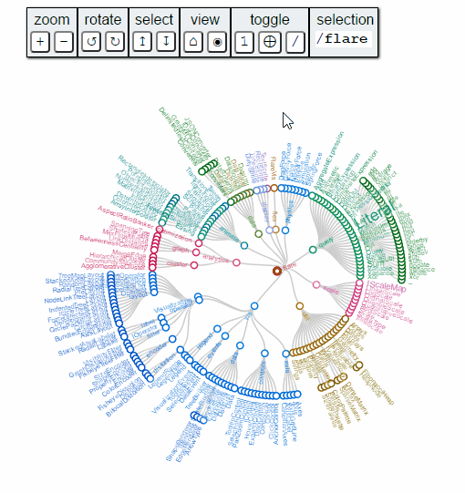

<!-- README.md is generated from README.Rmd. Please edit that file -->
### d3 Radial Networks with a UI!

Based on Wm Leler's [radial network](), this R [`htmlwidget`](http://htmlwidgets.org) provides a highly interactive radial network with a UI for zoom, collapse, and search. For more details, see the BuildingWidgets post [Week 21 | radialNetwork](http://www.buildingwidgets.com/blog/2015/5/28/week-21-radialnetwork).

### Example

``` r
#devtools::install_github("timelyportfolio/radialNetworkR")

library(radialNetworkR)

radialNetwork(
 jsonlite::fromJSON( 
  paste0(
    readLines(
      "https://gist.githubusercontent.com/mbostock/1093025/raw/a05a94858375bd0ae023f6950a2b13fac5127637/flare.json"
    )
    ,collapse = "\n"
  ),
  simplifyDataFrame=FALSE
 )
)
```


